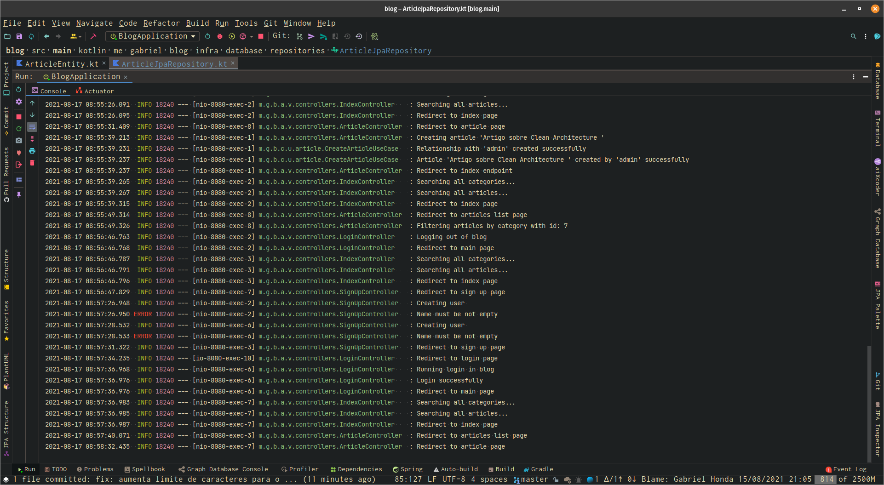
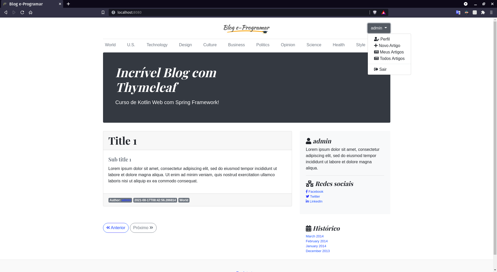
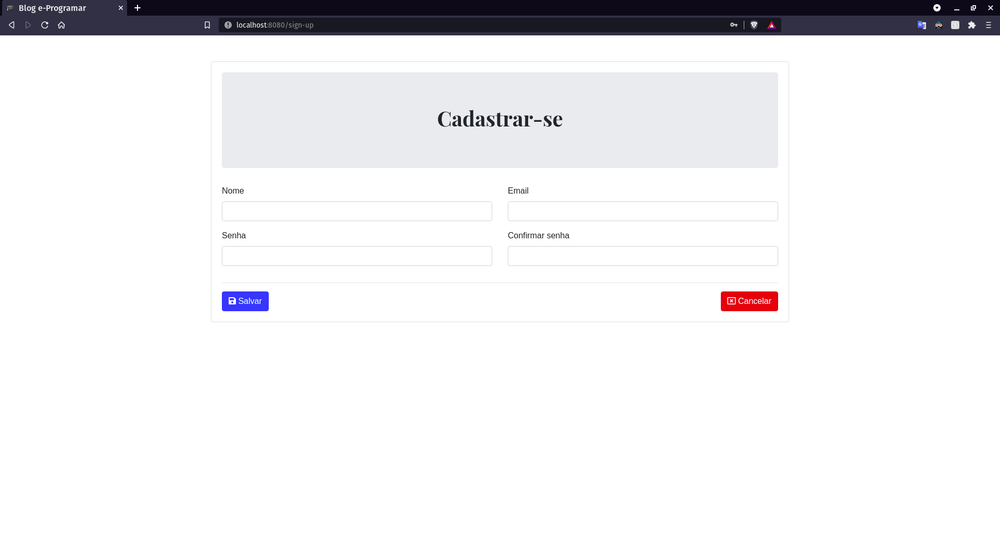
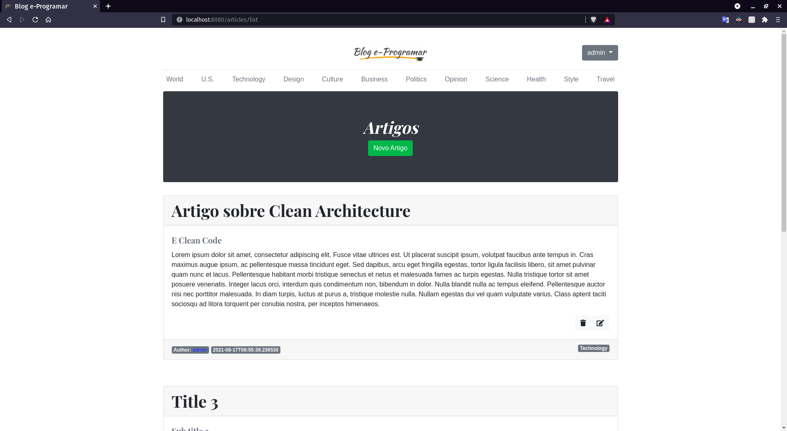
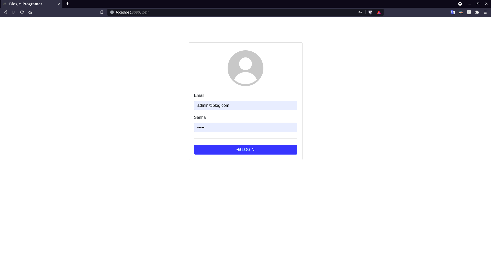
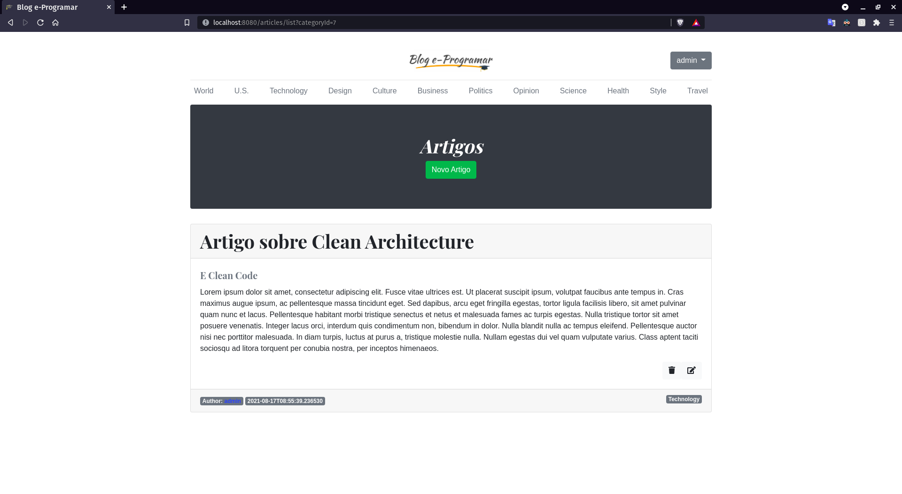
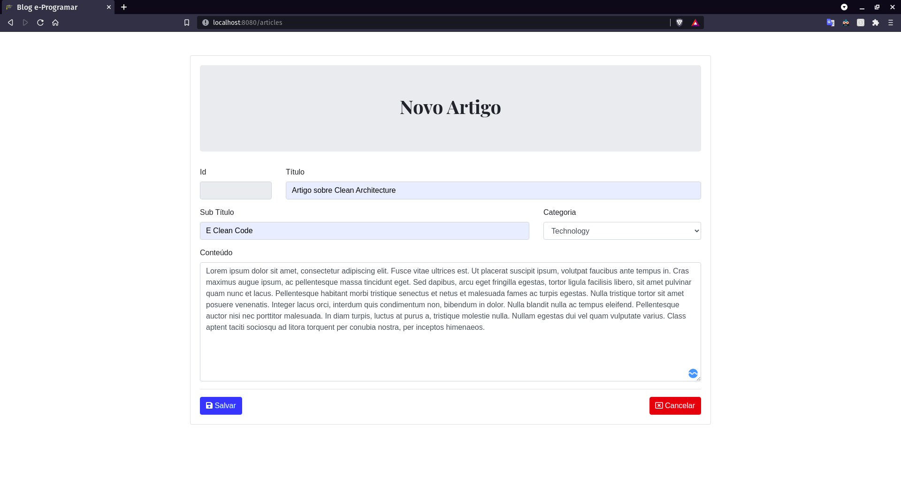

# Blog com Thymeleaf

Implementação de um blog utilizando Thymeleaf, Spring MVC e Kotlin.


## Implementação

### Tecnologias

| Tecnologia        | Versão        |
|------------------ |---------------|
| ```Kotlin```      | ```1.5.x```   |
| ```Java```        | ```11.x```    |
| ```Spring Boot``` | ```2.5.x```   |
| ```Thymeleaf```   | ```2.5.x```   |

### Logs




----------------------------------------------------------------------------------------

## Páginas

|          |  |
|-------------------------------------------------|------------------------------------|
|               |          |
|       |   |


